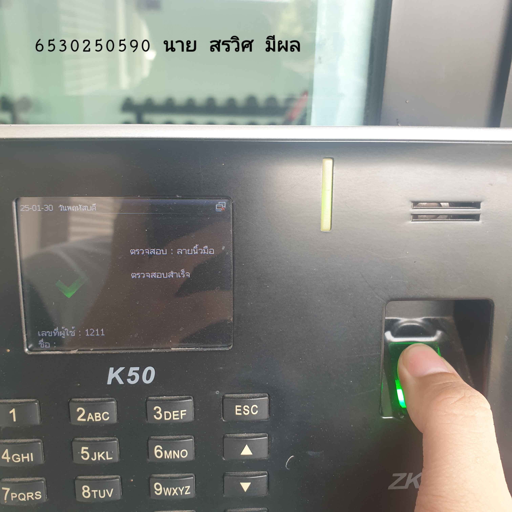

# 🔒 Security Control🔒  
## **Digital Door Lock**  
(กลอนประตูดิจิทัล)  

**📍 สถานที่ :**  
ประตูฟิตเนสหอพักเดอะโกวร์ท 
- **Type of SecurityControl** : Physical Control
  - เหตุผลที่เป็น Physical Access Control
    
    1.ควบคุมการเข้าถึงสถานที่จริง
    •ระบบนี้ใช้เพื่ออนุญาตหรือปฏิเสธการเข้าถึงพื้นที่ เช่น อาคาร สำนักงาน โรงงาน หรือห้องควบคุมข้อมูล    

    •หากบุคคลไม่มีสิทธิ์ (ไม่มีลายนิ้วมือที่ลงทะเบียน) จะไม่สามารถผ่านเข้าไปได้
    
    2.ต้องมีการยืนยันตัวตนทางกายภาพ
    •ผู้ใช้ต้อง วางนิ้วมือบนเครื่องสแกน ซึ่งเป็นการใช้ข้อมูลชีวมิติเพื่อระบุตัวตน
    
    •แตกต่างจาก Logical Access Control ที่ใช้รหัสผ่านหรือโทเค็นดิจิทัลในการเข้าใช้งานระบบไอที
    
    3.เป็นส่วนหนึ่งของระบบควบคุมความปลอดภัยทางกายภาพ
    
     •เครื่องสแกนลายนิ้วมือนี้มักใช้ร่วมกับ ประตูล็อกไฟฟ้า (Electronic Lock) หรือระบบควบคุมการเข้าถึงอื่น ๆ
     •เมื่อสแกนผ่าน ระบบอาจปลดล็อกประตูเพื่อให้สามารถเข้าไปในพื้นที่ได้

### 🛡️ **Control Functions: Preventative**  🛡️
-🔹 เหตุผลที่เป็น Preventative Control :
ทำหน้าที่ ป้องกัน การเข้าถึงพื้นที่โดยไม่ได้รับอนุญาตตรวจสอบตัวตนล่วงหน้าผ่านลายนิ้วมือ ก่อนให้สิทธิ์เข้าถึงลดโอกาสการปลอมแปลงข้อมูลหรือการเข้า-ออกโดยไม่ได้รับอนุญาต เปรียบเทียบกับ Control Functions อื่น ๆ
- 🔥 สรุป
เครื่องนี้ทำหน้าที่เป็น Preventative Control เพราะ เน้นป้องกัน ไม่ให้บุคคลที่ไม่ได้รับอนุญาตผ่านเข้า-ออกตั้งแต่แรก 🎯
